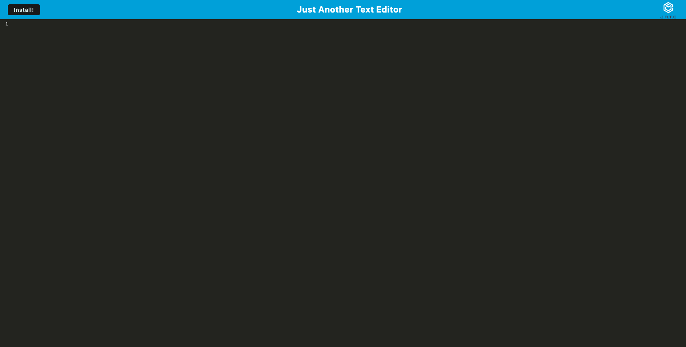

## Text Editor

  ### Licenses
  * License Badge: 
  * Link for license Badge: https://opensource.org/licenses/MIT

  ### User Story
  AS a web development student
  I WANT to be able to create unique and funky text
  SO THAT I can make my website look less boring

  ## TABLE OF CONTENTS
  * [Description](#description)
  * [Licenses](#licenses)
  * [Contribution](#contribution)
  * [Screenshot](#screenshot)

  ### Description
  A text editor app that you can download to your device!

  ### Licenses
  MIT

  ### Contribution
  Clay Andemar

  ### Screenshot
  
  